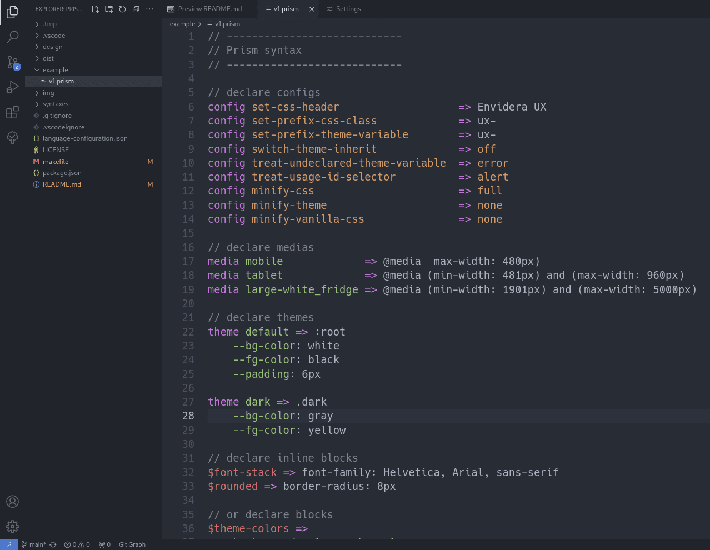

Prism syntax highlighting for VSCode

> This is currently a preview extension and might contain highlighting bugs. If you encounter any issues, please report them on [GitHub](https://github.com/envidera/prism-syntax-vscode/issues).

File extension: `.prism` only

Screenshot of the [One Dark Pro Mix](https://marketplace.visualstudio.com/items/zhuangtongfa.material-theme) theme with Prism syntax highlighting.

## License

MIT © Envidera 2024
